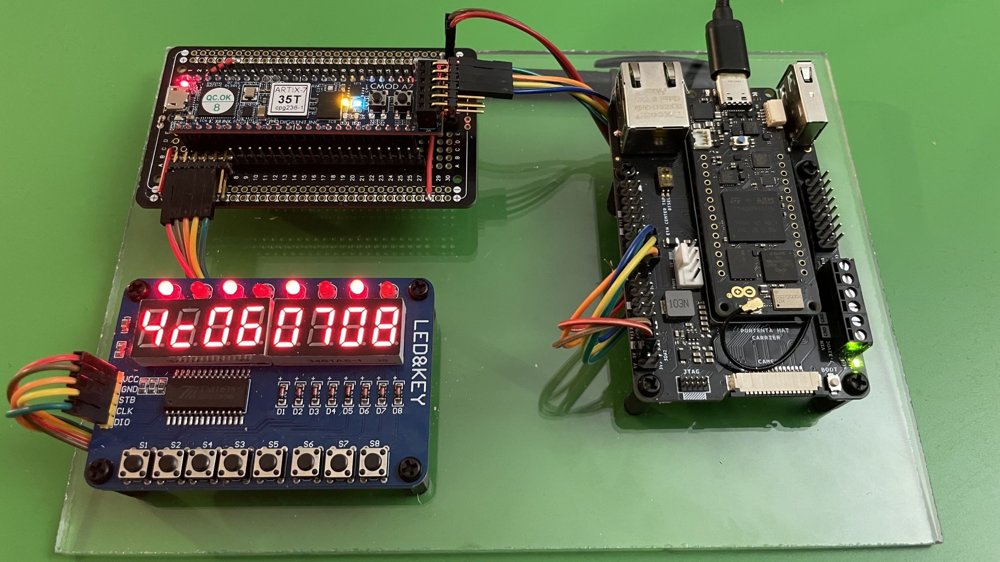

# Arduino-FPGA SPI Communication drivers
Here you can find the drivers, Arduino side and FPGA side, related to the project explained into my Linkedin article.

Please, refer to it for a detailed explaination.

## Arduino installation
Copy the folder **FPGADriver** into your Arduino *libraries* folder

## FPGA usage
Open a project inside \fpga with the related programming tool.

\fpga\cmod-a7\arduino_cmod-a7.xpr --> **Xilinx Vivado**

\fpga\tang-nano20k\arduino_fpga.gprj --> **GOWIN FPGA Designer**

\fpga\tang-nano9k\arduino_fpga.gprj --> **GOWIN FPGA Designer**

## Article

<a href="https://www.linkedin.com/pulse/" target="_blank">English version</a>

<a href="https://www.linkedin.com/pulse/" target="_blank">Italian version</a>

*Have fun*

